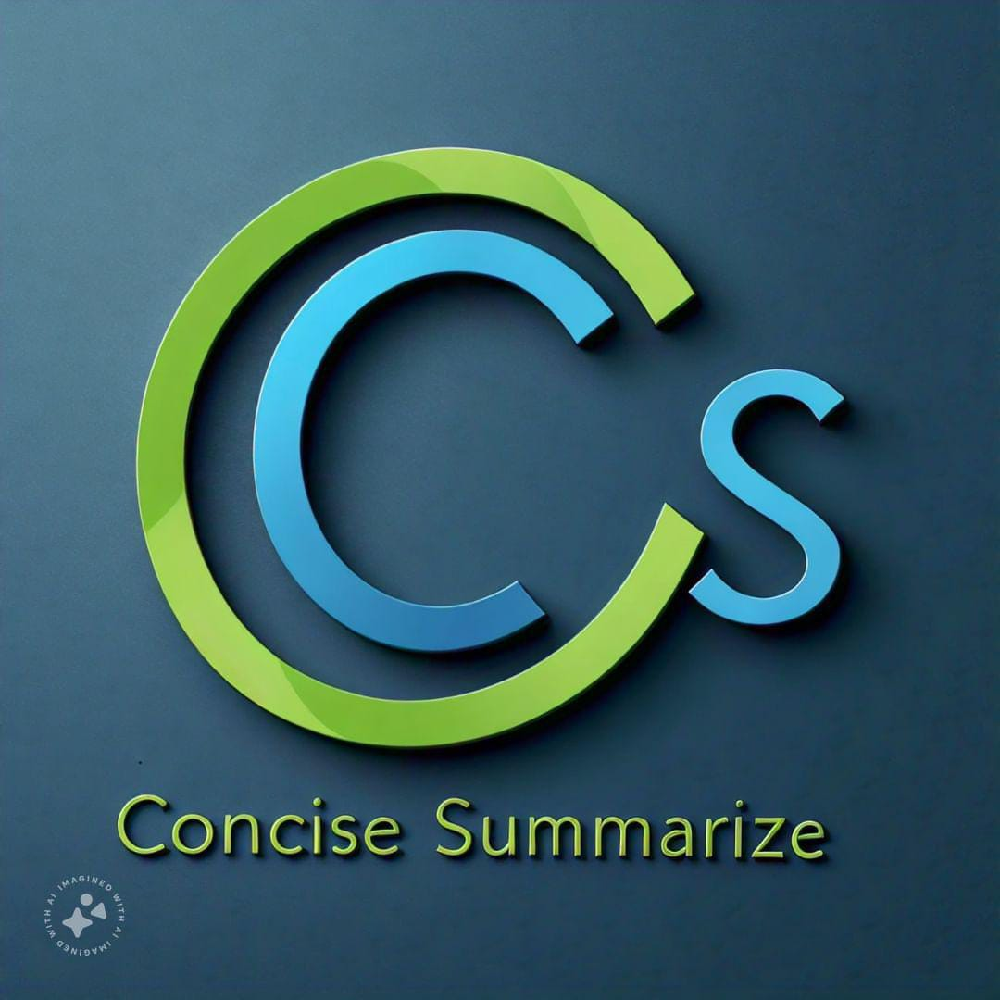

# Concise Summarize

<div align="center">
  
  
  <h3>AI-Powered Video Transcript Summarizer</h3>
  <p>Transform lengthy video transcripts into concise, accurate summaries in seconds</p>
</div>

 🚀 Features

- Fast Processing - Generate summaries in seconds with optimized AI
- Accurate Results - AI-powered analysis captures all key points
- VTT Support - Compatible with standard video transcript formats
- Modern UI - Clean, responsive design with smooth animations
- Easy to Use - Simple drag-and-drop interface

 🛠️ Technology Stack

# Frontend
- React 18 with TypeScript
- Vite for fast development and building
- Tailwind CSS for styling
- shadcn/ui for beautiful components
- React Router for navigation

# Backend
- Flask Python web framework
- Azure OpenAI GPT models for summarization
- CORS enabled for cross-origin requests

 📋 Prerequisites

- Node.js (v18 or higher)
- Python 3.8+
- Azure OpenAI API key

 🏃 Getting Started

# Frontend Setup

1. Clone the repository:
```bash
git clone
```

2. Install dependencies:
```bash
npm install
```

3. Start the development server:
```bash
npm run dev
```

The app will be available at `http://localhost:8080`

# Backend Setup

1. Navigate to the backend directory (or keep the `app.py` in root):
```bash
# If you have app.py in the project root, stay there
```

2. Install Python dependencies:
```bash
pip install flask flask-cors openai
```

3. Configure your Azure OpenAI credentials in `app.py`:
```python
openai.api_base = "YOUR_AZURE_OPENAI_ENDPOINT"
openai.api_key = "YOUR_API_KEY"
```

4. Start the Flask server:
```bash
python app.py
```

The API will be available at `http://localhost:8000`

 🎯 Usage

1. Open the application in your browser
2. Upload a `.vtt` (Video Text Tracks) file
3. Click "Generate Summary"
4. View and copy your AI-generated summary

 📁 Project Structure

```
concise-summarize/
├── src/
│   ├── assets/          # Images and static files
│   ├── components/      # React components
│   │   ├── ui/         # shadcn/ui components
│   │   ├── Navbar.tsx
│   │   ├── FileUpload.tsx
│   │   └── SummaryDisplay.tsx
│   ├── pages/          # Page components
│   │   ├── Index.tsx
│   │   ├── About.tsx
│   │   └── NotFound.tsx
│   ├── lib/            # Utilities
│   ├── App.tsx
│   └── main.tsx
├── app.py              # Flask backend API
├── index.html
├── tailwind.config.ts
└── package.json
```

 🔧 Configuration

# Connecting to the Backend

In `src/pages/Home.tsx`, uncomment the actual API call code and comment out the mock implementation:

```typescript
// Replace the mock setTimeout code with:
const response = await fetch("http://localhost:8000/api/summarize", {
  method: "POST",
  headers: { "Content-Type": "application/json" },
  body: JSON.stringify({ transcript }),
});
const data = await response.json();
setSummary(data.summary);
```

 🚀 Deployment

# Frontend Deployment

Build for production:
```bash
npm run build
```

The built files will be in the `dist` directory, ready to deploy to:
- Vercel
- Netlify
- GitHub Pages
- Any static hosting service

# Backend Deployment

Deploy the Flask API to:
- Azure App Service
- Heroku
- Railway
- Any Python hosting platform

Remember to set environment variables for your API keys in production!

 🤝 Contributing

Contributions are welcome! Please feel free to submit a Pull Request.

 📝 License

This project is open source and available under the MIT License.


 🙏 Acknowledgments

- Azure OpenAI for powerful language models
- shadcn/ui for beautiful components
- The React and Flask communities

---

<div align="center">
  <p>If you find this project helpful, please give it a ⭐!</p>
</div>
